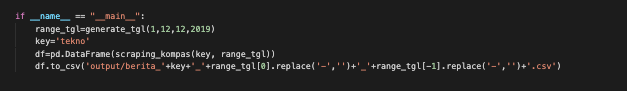

# Project Title

SCRAPING BERITA DI WEB https://indeks.kompas.com/ MENGGUNAKAN BS4

## Getting Started

Scraping article from kompas.com using BeautifulSoup

Parameters:
* start date
* end date
* month
* year
* key (means category for the articles like :tekno, techno, finance etc)

The result is in .csv file and it will be look like 

